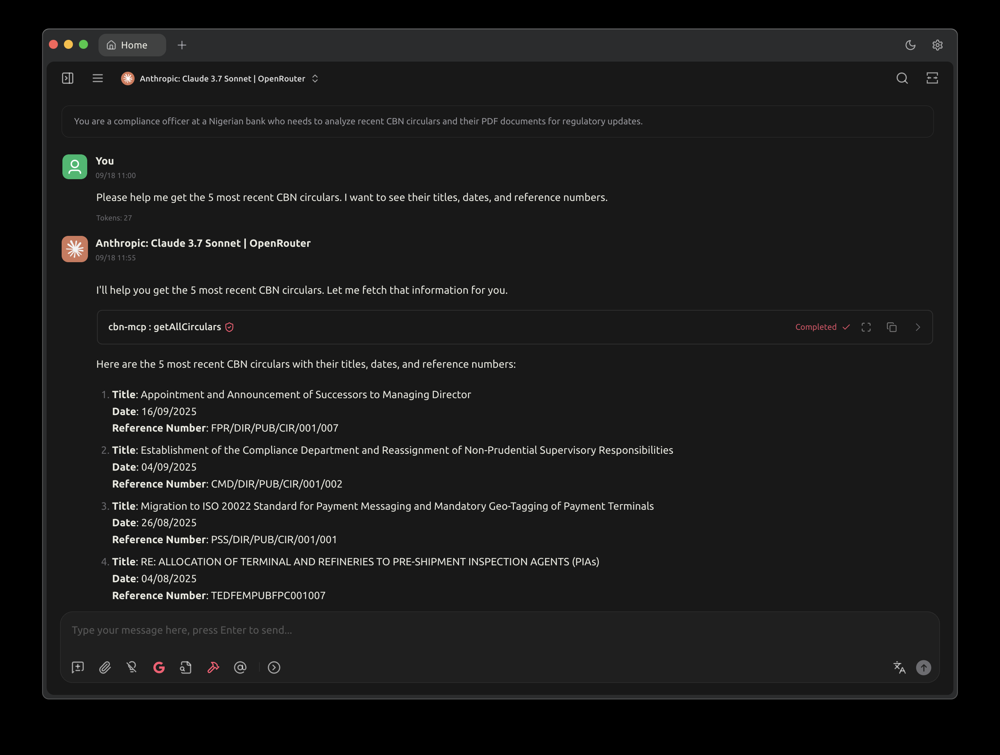

# CBN MCP Server



A Model Context Protocol (MCP) server for accessing Central Bank of Nigeria (CBN) data and circulars. Connect this server to Cursor, Claude Desktop, or any MCP-compatible application to access CBN regulatory information directly in your AI conversations.

## Features

### MCP Tools
- **getAllCirculars**: Fetch all CBN circulars with optional filtering by date range and category
- **getCircularById**: Get a specific CBN circular by its ID
- **searchCirculars**: Search CBN circulars by title or description keywords
- **fetchCircularPdf**: Download and read PDF content of CBN circulars
- **fetchCircularPdfById**: Download PDF content by circular ID

### MCP Resources
- **cbnApiStatus**: Current status and health of the CBN API connection
- **serverInfo**: Information about this CBN MCP server

### MCP Prompts
- **circularSummary**: Generate a summary prompt for CBN circulars analysis
- **regulatoryAnalysis**: Generate prompts for regulatory compliance analysis of CBN circulars

## Quick Start

### Option 1: Download Pre-built Binary (Easiest)
1. Go to [Releases](https://github.com/chiziaruhoma/cbn_mcp/releases)
2. Download the `cbn_mcp` executable
3. Make it executable: `chmod +x cbn_mcp`
4. Use path: `/path/to/cbn_mcp`

### Option 2: Run with Dart (If you have Dart installed)
1. Clone this repository: `git clone https://github.com/chiziaruhoma/cbn_mcp.git`
2. Navigate to directory: `cd cbn_mcp`
3. Install dependencies: `dart pub get`
4. Use command: `dart run bin/main.dart`

### Option 3: Build from Source
1. Follow Option 2 steps 1-3
2. Build executable: `dart compile exe bin/main.dart -o cbn_mcp`
3. Use path: `/path/to/cbn_mcp`

## Integration with AI Applications

### Cursor IDE

1. Open Cursor settings (Cmd/Ctrl + ,)
2. Go to "Features" → "Model Context Protocol"
3. Add a new MCP server with **one of these configurations**:

   **Using pre-built binary:**
   ```json
   {
     "name": "cbn-mcp",
     "command": "/path/to/cbn_mcp"
   }
   ```

   **Using Dart (if you have Dart installed):**
   ```json
   {
     "name": "cbn-mcp",
     "command": "dart",
     "args": ["run", "bin/main.dart"],
     "cwd": "/path/to/cbn_mcp"
   }
   ```

4. Restart Cursor
5. Now you can ask questions like: "What are the latest CBN circulars?" or "Find CBN regulations about forex trading"

### Claude Desktop

1. Open Claude Desktop settings
2. Navigate to the MCP servers configuration
3. Add the CBN MCP server with **one of these configurations**:

   **Using pre-built binary:**
   ```json
   {
     "mcpServers": {
       "cbn-mcp": {
         "command": "/path/to/cbn_mcp"
       }
     }
   }
   ```

   **Using Dart (if you have Dart installed):**
   ```json
   {
     "mcpServers": {
       "cbn-mcp": {
         "command": "dart",
         "args": ["run", "bin/main.dart"],
         "cwd": "/path/to/cbn_mcp"
       }
     }
   }
   ```

4. Restart Claude Desktop
5. The CBN tools will be available in your conversations

### Other MCP-Compatible Applications

For any application that supports MCP:
1. Add the server configuration pointing to the `cbn_mcp` executable
2. The server will expose CBN data access tools to your AI assistant

## Usage Examples

Once integrated, you can ask your AI assistant:

- "What are the latest CBN circulars from this month?"
- "Find all CBN regulations related to cryptocurrency"
- "Get me the details of CBN circular BSD/DIR/GEN/LAB/11/020"
- "Summarize the key points from recent CBN monetary policy circulars"
- "What are the compliance requirements for banks based on recent CBN circulars?"

## Development